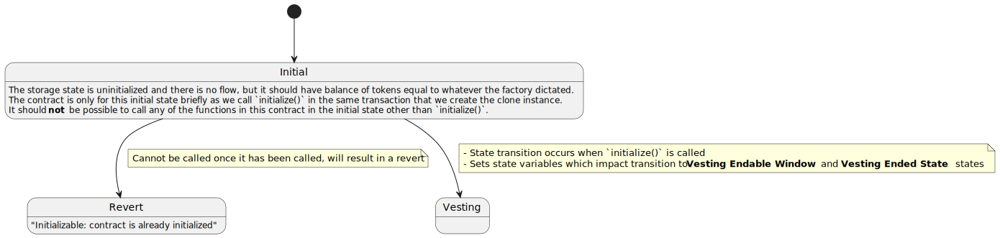
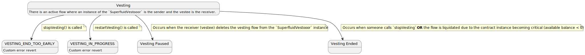
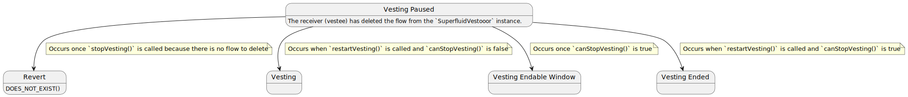
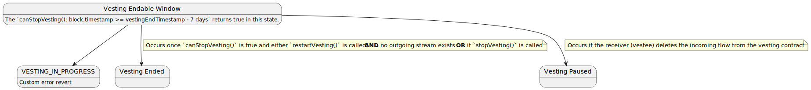
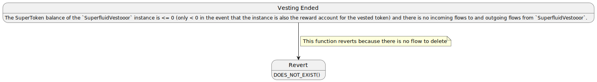

# Superfluid Vestooor Contracts

## About

A foundry/Hardhat hybrid project which illustrates a simple implementation of a vesting contract built with Superfluid.

## Built With

-   [@superfluid-finance/ethereum-contracts](https://www.npmjs.com/package/@superfluid-finance/ethereum-contracts)
-   [@superfluid-finance/sdk-core](https://www.npmjs.com/package/@superfluid-finance/sdk-core)
-   [foundry](https://github.com/foundry-rs/foundry)
-   [Hardhat](https://hardhat.org/)

## Prerequisites

In order to run this project, you need to have the following dependencies installed on your computer:

-   [foundry](https://github.com/foundry-rs/foundry)
-   [yarn](https://yarnpkg.com/getting-started/install) or you can just use [npm](https://www.npmjs.com/package/npm)

Run `npm install`, `yarn install` or `pnpm install` to install packages.

> NOTE: This project support yarn by default.

Check out the `.env.example` file to see what sort of environment variables to place in your `.env` file to be able to use all the features available.

## Deployments and Verification

### Hardhat

**Steps**

1. Deploy the `SuperfluidVestooor` implementation contract with: `npx hardhat run scripts/runDeploySuperfluidVestooor.ts --network <NETWORK_NAME>`. Make sure to save the address, this is the `<IMPLEMENTATION_ADDRESS>` used below.
2. Deploy the `SuperfluidVestooorFactory` contract with: `npx hardhat deploy-factory --implementation <IMPLEMENTATION_ADDRESS> --token <SUPER_TOKEN_ADDRESS> --network <NETWORK_NAME>`.

This will deploy the contracts, wait for several confirmations and then verify the contracts.

If you want to manually verify contracts, you can use the following command: `npx hardhat verify --network <NETWORK_NAME> DEPLOYED_CONTRACT_ADDRESS "Constructor argument 1" `

### Foundry

<!--TODO-->

## Useful Commands

`npx hardhat node` to spin up a local Hardhat node (required for local tests).

`npx hardhat console` to run hardhat in CLI. You can specify additional settings: `--network <NETWORK_NAME>` to run on a specific network.

`yarn test` to run the Hardhat tests.

`yarn dev` for TDD, this runs `yarn test` on changes to `.sol, .ts` files.

`yarn coverage` t geonerate a coverage report (tests).

`yarn gas` to generate a gas report of the contracts.

`yarn types` to force create typechain types based on the contracts.

`yarn format` to use prettier to format the files based on the .`prettierrc.js` file.

`yarn lint` to run linting on `.ts` files.

`yarn fix` to fix any issues based on the `.eslintrc.json` file.

`yarn clean` to essentially reset files

## SuperfluidVestooor State Machine

**Plant UML Diagram**

### States

-   Initial State: `[I]`
-   Vesting State: `[V]`
-   Vesting Paused State: `[P]`
-   Vesting Endable Window: `[W]`
-   Vesting Ended State: `[E]`

### Initial State [I]

**Plant UML Diagram**

**Description**

The storage state is uninitialized and there is no flow, but it should have balance of tokens equal to whatever the factory dictated.

The contract is only for this initial state briefly as we call `initialize` in the same transaction that we create the clone instance.

It should **not** be possible to call any of the functions in this contract in the initial state other than `initialize`.

**Functions**

-   `initialize`
    -   Transitions contract from **Initial State** into **Vesting State**
    -   Has direct impact on when **Vesting Endable Window** and **Vesting Ended State** states will be reached based on the state variables passed from the factory and set for this instance in initialization
    -   Cannot be called once it has been called, will result in a revert with `"Initializable: contract is already initialized"`

**Transitions**

-   `[I]` => `[V]`: This occurs at the end of `initialize`.

### Vesting State [V]

**Plant UML Diagram**

**Description**

There is an active flow where an instance of the `SuperfluidVestooor` is the sender and the vestee is the receiver.

**Functions**

-   `restartVesting`
    -   This function will revert with the custom error: `VESTING_IN_PROGRESS()`.
-   `stopVesting`
    -   This function will revert with the custom error: `VESTING_END_TOO_EARLY()`.

**Transitions**

-   `[V]` => `[P]`: Occurs when the receiver (vestee) deletes the vesting flow from the `SuperfluidVestooor` instance
-   `[V]` => `[W]`: Occurs once `canStopVesting` is true (when `block.timestamp` is greater or equal to 7 days (in seconds) before the `vestingEndTimestamp` set in the initialization
-   `[V]` => `[E]`: Occurs when someone calls `stopVesting` **OR** the flow is liquidated due to the contract instance becoming critical (available balance < 0)

### Vesting Paused State [P]

**Plant UML Diagram**

**Description**

The receiver (vestee) has deleted the flow from the `SuperfluidVestooor` instance.

**Functions**

-   `restartVesting`
    -   This function can cause a state change to `Vesting Ended State` if `canStopVesting` is true
    -   This function can cause a state change to `Vesting State` if `canStopVesting` is false
-   `stopVesting`
    -   This function will revert because there is no flow to delete

**Transitions**

-   `[P]` => `[V]`: Occurs when `restartVesting` is called and `canStopVesting` is false
-   `[P]` => `[E]`: Occurs when `restartVesting` is called and `canStopVesting` is true
-   `[P]` => `[W]`: Occurs once `canStopVesting` is true

### Vesting Endable Window [W]

**Plant UML Diagram**

**Description**

The `canStopVesting(): block.timestamp >= vestingEndTimestamp - 7 days` returns true in this state.

**Functions**

-   `restartVesting`
    -   This function can revert with the custom error: `VESTING_IN_PROGRESS()` if a stream exists.
    -   This function can cause a state change to `Vesting Ended State` if `canStopVesting` is true
-   `stopVesting`
    -   This function can cause a state change to `Vesting Ended State`

**Transitions**

-   `[W]` => `[E]`: Occurs once `canStopVesting` is true and either `restartVesting` is called **AND** no outgoing stream exists **OR** if `stopVesting` is called

### Vesting Ended State

**Plant UML Diagram**

**Description**

The SuperToken balance of the `SuperfluidVestooor` instance is <= 0 (only < 0 in the event that the instance is also the reward account for the vested token) and there is no incoming flows to and outgoing flows from `SuperfluidVestooor`.

**Functions**

-   `restartVesting`
    -   This function will just transfer 0 tokens to the owner and emit an event.
-   `stopVesting`
    -   This function will revert because there is no flow to delete
